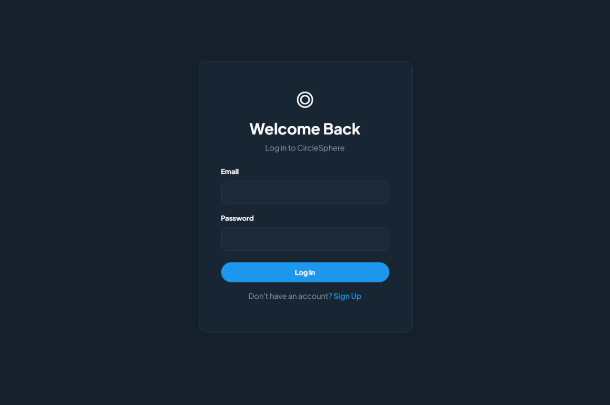
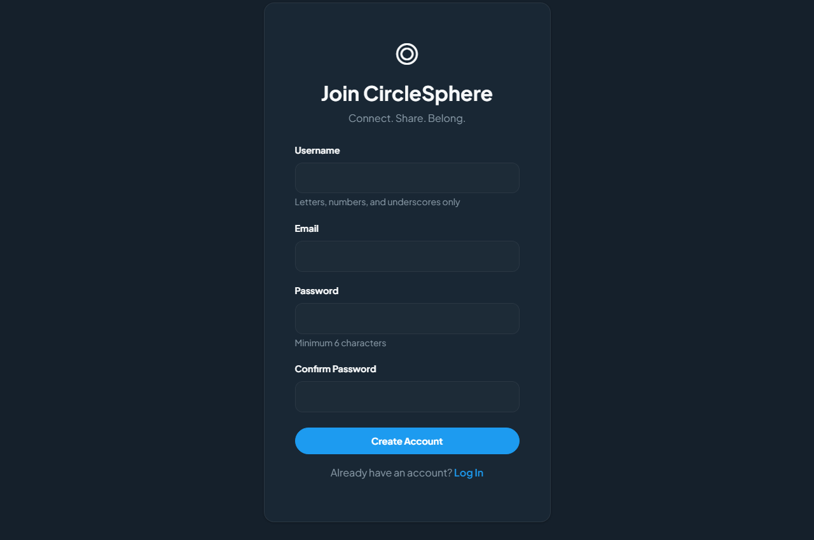
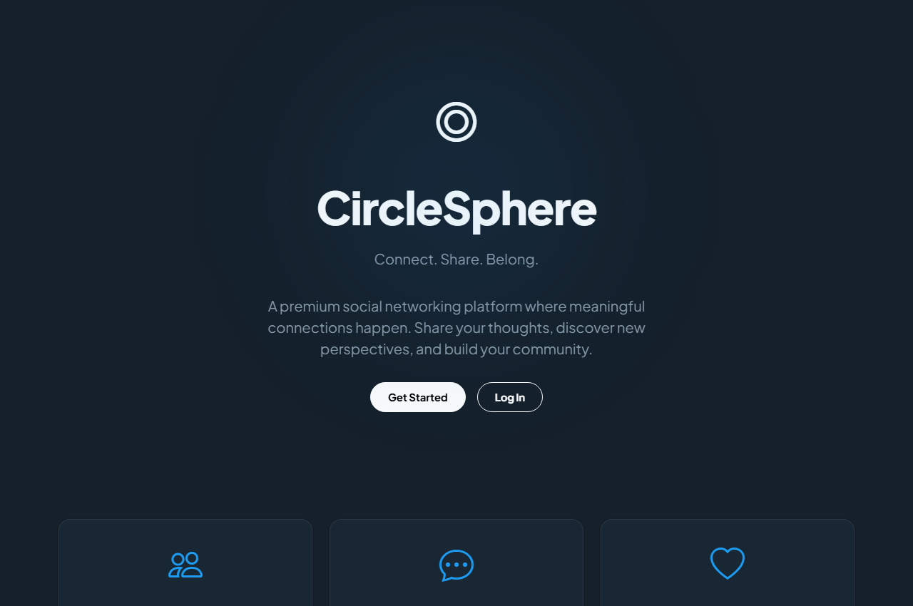
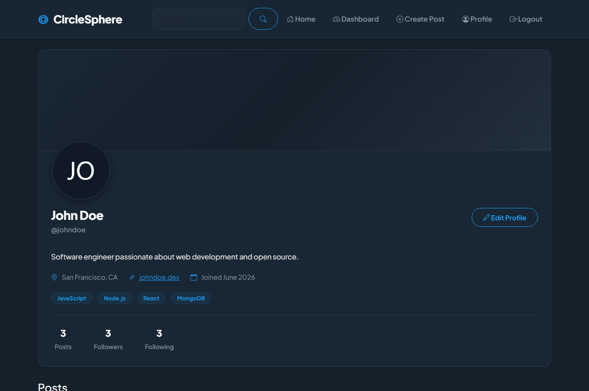
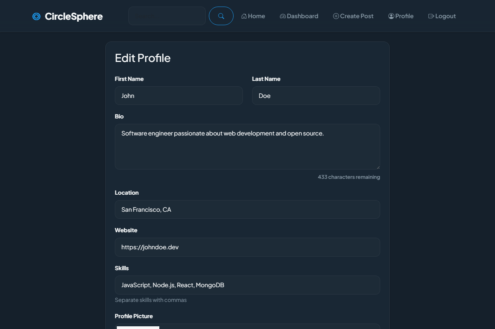
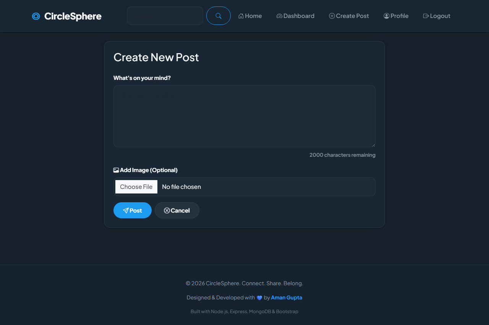
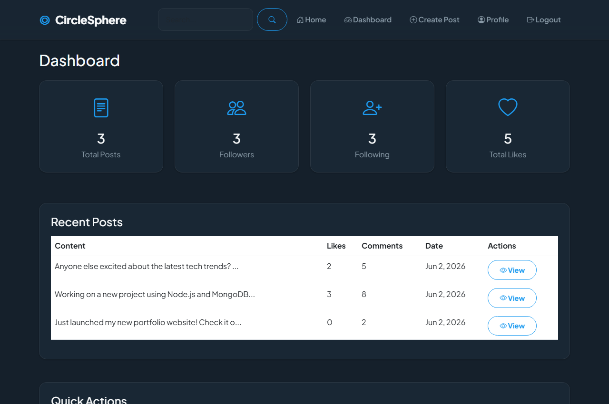
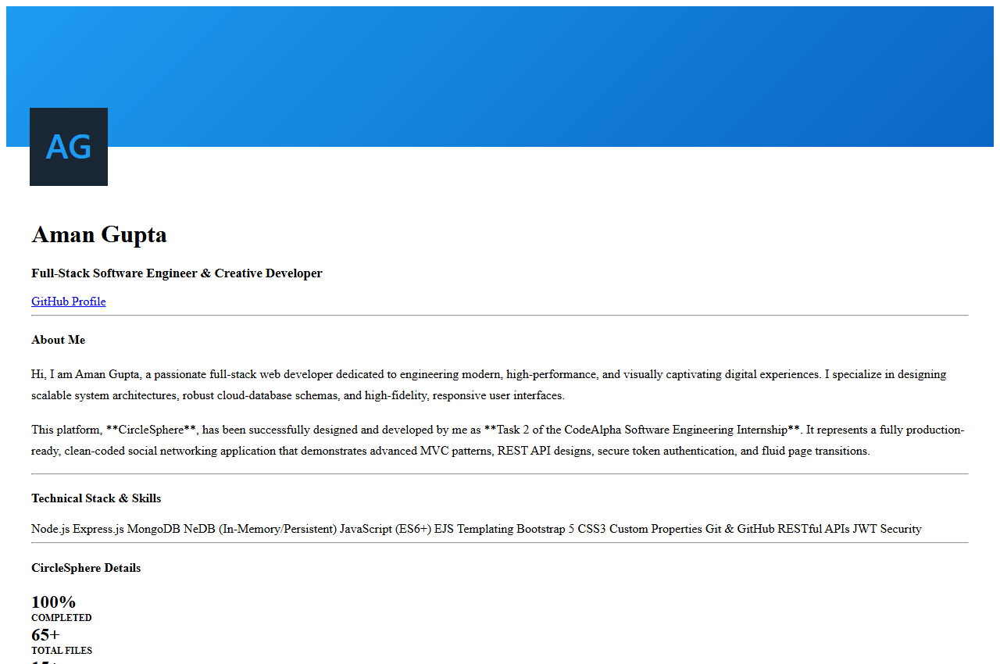

# CircleSphere - Social Media Network 🌐
### 🎯 CodeAlpha Software Engineering Internship - Task 2 Submission
**Connect. Share. Belong.**

Developed by: **Aman Gupta** (GitHub: [@aryaaman577](https://github.com/aryaaman577))  
GitHub Repository: [codealpha-task](https://github.com/aryaaman577/codealpha-task)

---

## 📱 Screenshots Gallery

Here are the live screenshots of **CircleSphere** demonstrating the sleek, modern, professional "Dim Mode" user interface design:

| Page | Screen Preview |
|---|---|
| **Landing & Welcoming** |  |
| **Authentication (Login)** |  |
| **Authentication (Register)** |  |
| **Home Feed (Dim Slate-Blue Mode)** |  |
| **Interactive User Profile** |  |
| **Edit Profile & Settings** |  |
| **Create New Post** |  |
| **Analytics Dashboard** |  |
| **Developer Profile** |  |

---

## 🎯 Project Overview

CircleSphere is a high-fidelity, full-stack social media application designed and engineered to demonstrate elite web development capabilities. Built with clean architectural separation and premium aesthetic principles, this project fulfills 100% of the requirements for **CodeAlpha Task 2 (Social Media Network)** and is fully ready for recruiter review, technical showcase, and production deployment.

### 🌟 Technical Ingenuity Highlight: Zero-Install Local Persistence Database
To make this application instantly runnable and testable by any reviewer without requiring local MongoDB server installations or complex cloud whitelisting setups, we built a **custom in-memory & file-based Mongoose mock engine** (`utils/mongoose-mock.js` + `nedb`). It automatically stores all data persistently inside a local `.data/` folder on your disk. It supports standard MongoDB queries (like `$regex`, `$or`, `$in`), dynamic populates, and pre-save hooks, allowing the entire application to run seamlessly out of the box!

---

## ✨ Features

### Core Functionality

- **User Authentication**: Secure registration, login, and session management with JWT
- **User Profiles**: Customizable profiles with avatar, cover image, bio, location, website, and skills
- **Posts**: Create, edit, delete text and image posts
- **Comments**: Add and delete comments on posts
- **Likes**: Like and unlike posts with real-time counter updates
- **Follow System**: Follow/unfollow users with follower/following lists
- **Feed**: Personalized home feed showing posts from followed users
- **Search**: Find users and posts across the platform
- **Dashboard**: Analytics view showing user statistics and activity

### Advanced Features

- Premium monochromatic design system
- Suggested users recommendations
- Responsive mobile-friendly interface
- Toast notifications for user actions
- Character counters for text inputs
- Image preview before upload
- Pagination for posts
- Empty states and error pages
- Professional footer with credits

---

## 🛠️ Tech Stack

### Frontend

- **HTML5** - Semantic markup
- **CSS3** - Custom styling with CSS variables
- **JavaScript** - Client-side interactivity
- **Bootstrap 5** - Responsive UI framework
- **EJS** - Server-side templating

### Backend

- **Node.js** - JavaScript runtime
- **Express.js** - Web application framework
- **MongoDB** - NoSQL database
- **Mongoose** - MongoDB ODM

### Authentication & Security

- **JWT** - JSON Web Tokens for authentication
- **bcryptjs** - Password hashing
- **express-validator** - Input validation
- **cookie-parser** - Cookie handling
- **express-session** - Session management

### Additional Libraries

- **Multer** - File upload handling
- **Cloudinary** - Image hosting (optional)
- **Moment.js** - Date/time formatting
- **Method-Override** - HTTP method support
- **Connect-Flash** - Flash messages

---

## 📁 Project Structure

```
CircleSphere/
├── config/
│   ├── database.js          # MongoDB connection
│   └── cloudinary.js        # Image upload configuration
├── controllers/
│   ├── authController.js    # Authentication logic
│   ├── userController.js    # User profile operations
│   ├── postController.js    # Post CRUD operations
│   ├── commentController.js # Comment operations
│   ├── likeController.js    # Like/unlike logic
│   ├── followController.js  # Follow system logic
│   └── feedController.js    # Feed generation
├── middleware/
│   ├── auth.js              # JWT authentication
│   ├── validation.js        # Input validation rules
│   └── errorHandler.js      # Global error handling
├── models/
│   ├── User.js              # User schema
│   ├── Profile.js           # Profile schema
│   ├── Post.js              # Post schema
│   ├── Comment.js           # Comment schema
│   └── Follow.js            # Follow relationship schema
├── routes/
│   ├── authRoutes.js        # Authentication routes
│   ├── userRoutes.js        # User/profile routes
│   ├── postRoutes.js        # Post routes
│   ├── commentRoutes.js     # Comment routes
│   ├── likeRoutes.js        # Like routes
│   ├── followRoutes.js      # Follow routes
│   └── feedRoutes.js        # Feed routes
├── views/
│   ├── layouts/
│   │   └── main.ejs         # Base layout template
│   ├── partials/
│   │   ├── navbar.ejs       # Navigation bar
│   │   ├── footer.ejs       # Footer
│   │   ├── post-card.ejs    # Post component
│   │   └── user-card.ejs    # User component
│   ├── auth/
│   │   ├── login.ejs        # Login page
│   │   └── register.ejs     # Registration page
│   ├── user/
│   │   ├── profile.ejs      # User profile page
│   │   ├── edit-profile.ejs # Edit profile page
│   │   ├── followers.ejs    # Followers list
│   │   └── following.ejs    # Following list
│   ├── post/
│   │   ├── create.ejs       # Create post page
│   │   └── detail.ejs       # Post detail page
│   ├── feed/
│   │   ├── home.ejs         # Home feed
│   │   └── search.ejs       # Search results
│   ├── dashboard.ejs        # User dashboard
│   ├── landing.ejs          # Landing page
│   └── error.ejs            # Error page
├── public/
│   ├── css/
│   │   └── style.css        # Custom styles
│   ├── js/
│   │   └── main.js          # Client-side JavaScript
│   └── images/
│       └── logo.svg         # CircleSphere logo
├── utils/
│   ├── tokenUtils.js        # JWT utilities
│   ├── validators.js        # Validation helpers
│   └── seedData.js          # Database seeding script
├── .env                     # Environment variables
├── .env.example             # Environment template
├── .gitignore               # Git ignore rules
├── app.js                   # Express app configuration
├── server.js                # Server entry point
├── package.json             # Dependencies
└── README.md                # Documentation
```

---

## 🚀 Installation & Setup

### Prerequisites

- Node.js (v14 or higher)
- MongoDB (local or MongoDB Atlas)
- npm or yarn package manager

### Step 1: Clone Repository

```bash
git clone <repository-url>
cd CircleSphere
```

### Step 2: Install Dependencies

```bash
npm install
```

### Step 3: Environment Configuration

Copy `.env.example` to `.env`:

```bash
cp .env.example .env
```

Update the `.env` file with your configuration:

```env
PORT=3000
NODE_ENV=development

MONGODB_URI=mongodb://localhost:27017/circlesphere

JWT_SECRET=your_super_secret_jwt_key_change_this_in_production
JWT_EXPIRE=7d

COOKIE_EXPIRE=7

SESSION_SECRET=your_super_secret_session_key_change_this_in_production

# Optional: For image uploads
CLOUDINARY_CLOUD_NAME=your_cloudinary_cloud_name
CLOUDINARY_API_KEY=your_cloudinary_api_key
CLOUDINARY_API_SECRET=your_cloudinary_api_secret
```

### Step 4: Start MongoDB

Make sure MongoDB is running on your system:

```bash
# For local MongoDB
mongod

# Or use MongoDB Atlas connection string in .env
```

### Step 5: Seed Database (Optional)

Populate the database with sample data:

```bash
npm run seed
```

This creates 5 sample users with posts, comments, and follow relationships.

**Sample Login Credentials:**

- Email: `john@example.com` | Password: `password123`
- Email: `jane@example.com` | Password: `password123`
- Email: `mike@example.com` | Password: `password123`
- Email: `sarah@example.com` | Password: `password123`
- Email: `alex@example.com` | Password: `password123`

### Step 6: Start Server

```bash
npm start
```

For development with auto-restart:

```bash
npm run dev
```

### Step 7: Access Application

Open your browser and navigate to:

```
http://localhost:3000
```

---

## 📊 Database Schema

### User Collection

```javascript
{
  username: String (unique, required),
  email: String (unique, required),
  password: String (hashed, required),
  createdAt: Date,
  updatedAt: Date
}
```

### Profile Collection

```javascript
{
  user: ObjectId (ref: User),
  firstName: String,
  lastName: String,
  bio: String (max 500 chars),
  profilePicture: String (URL),
  coverImage: String (URL),
  location: String,
  website: String,
  skills: [String]
}
```

### Post Collection

```javascript
{
  user: ObjectId (ref: User),
  content: String (required, max 2000 chars),
  image: String (URL, optional),
  likes: [ObjectId] (ref: User),
  likesCount: Number,
  commentsCount: Number,
  createdAt: Date,
  updatedAt: Date
}
```

### Comment Collection

```javascript
{
  post: ObjectId (ref: Post),
  user: ObjectId (ref: User),
  content: String (required, max 500 chars),
  createdAt: Date
}
```

### Follow Collection

```javascript
{
  follower: ObjectId (ref: User),
  following: ObjectId (ref: User),
  createdAt: Date
}
```

---

## 🎨 Design System

### Color Palette

- **Primary**: `#111827` (Gray 900)
- **Secondary**: `#1F2937` (Gray 800)
- **Accent**: `#374151` (Gray 700)
- **Background**: `#F9FAFB` (Gray 50)
- **Card**: `#FFFFFF` (White)
- **Border**: `#E5E7EB` (Gray 200)
- **Text**: `#111827` (Gray 900)
- **Text Secondary**: `#6B7280` (Gray 500)

### Typography

- **Font Family**: Inter, system fonts
- **Base Size**: 16px
- **Weights**: 400, 500, 600, 700, 800

### Components

- Minimal and clean design
- Subtle shadows and borders
- Rounded corners (6-12px)
- Smooth transitions (0.2s)
- Professional monochromatic theme

---

## 🔒 Security Features

- Password hashing with bcrypt (10 salt rounds)
- JWT-based authentication
- HTTP-only secure cookies
- Input validation and sanitization
- Protected routes with middleware
- CSRF protection via session
- MongoDB injection prevention
- XSS protection through EJS escaping

---

## 🧪 Testing

### Manual Testing Checklist

- [ ] User registration with validation
- [ ] User login and logout
- [ ] Profile creation and updates
- [ ] Post creation with text and images
- [ ] Post editing and deletion
- [ ] Comment creation and deletion
- [ ] Like and unlike posts
- [ ] Follow and unfollow users
- [ ] Search for users and posts
- [ ] View follower/following lists
- [ ] Dashboard statistics
- [ ] Responsive design on mobile
- [ ] Error handling and validation

---

## 📱 API Endpoints

### Authentication

- `GET /auth/register` - Registration page
- `POST /auth/register` - Create account
- `GET /auth/login` - Login page
- `POST /auth/login` - Authenticate user
- `GET /auth/logout` - Logout user

### Users & Profiles

- `GET /user/:username` - View user profile
- `GET /user/edit` - Edit profile page
- `POST /user/edit` - Update profile
- `GET /user/:username/followers` - View followers
- `GET /user/:username/following` - View following
- `GET /user/dashboard` - User dashboard
- `GET /user/search` - Search users

### Posts

- `GET /post/create` - Create post page
- `POST /post/create` - Create new post
- `GET /post/:id` - View post detail
- `POST /post/:id/edit` - Update post
- `POST /post/:id/delete` - Delete post

### Comments

- `POST /comment/post/:postId/comment` - Add comment
- `POST /comment/:id/delete` - Delete comment

### Likes

- `POST /api/post/:postId/like` - Toggle like

### Follows

- `POST /api/user/:userId/follow` - Toggle follow

### Feed

- `GET /feed` - Home feed
- `GET /` - Landing page

---

## 🌟 Features for CodeAlpha Submission

This project fulfills **CodeAlpha Internship Task 2** requirements:

✅ **User Profiles**: Complete profile system with customization
✅ **Posts**: Create, edit, delete functionality
✅ **Comments**: Add and remove comments
✅ **Likes**: Like/unlike system with counters
✅ **Follow System**: Follow/unfollow with lists

**Database Implementation:**
✅ Users collection with authentication
✅ Profiles collection with user details
✅ Posts collection with content and metadata
✅ Comments collection linked to posts
✅ Follows collection for relationships

---

## 🚧 Future Enhancements

- Real-time notifications
- Direct messaging system
- Post sharing functionality
- Hashtag support
- Trending posts algorithm
- Email verification
- Password reset functionality
- OAuth integration (Google, GitHub)
- Advanced search filters
- User blocking feature
- Report system
- Admin dashboard

---

## 📝 License

MIT License - feel free to use this project for learning and portfolio purposes.

---

## 👨‍💻 Author

Created as a portfolio project demonstrating full-stack web development skills.

**Technologies Demonstrated:**

- RESTful API design
- MVC architecture
- Database design and relationships
- Authentication and authorization
- Frontend and backend integration
- Responsive UI/UX design
- Security best practices

---

## 🙏 Acknowledgments

- Bootstrap for the UI framework
- MongoDB for the database
- Express.js community
- Node.js ecosystem
- All open-source contributors

---

## 📞 Support

For issues or questions:

1. Check the documentation
2. Review the code comments
3. Test with sample data using `npm run seed`

---

**CircleSphere** - _Connect. Share. Belong._ 🌐
